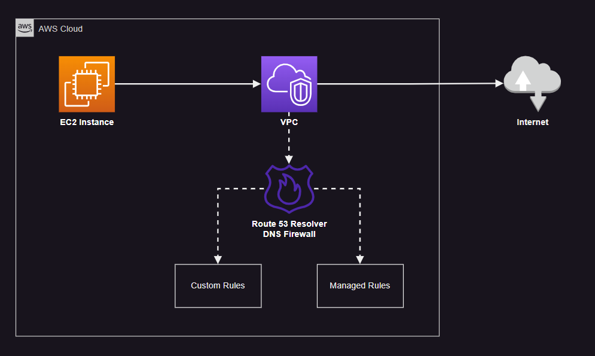

# AWS Route 53 Resolver DNS Firewall

Exfiltration protection with DNS firewall.



Create the infrastructure:

```sh
terraform init
terraform apply -auto-approve
```

After the provisioning, connect to the EC2 instance and test DNS resolution.

Example with override:


Example with `NODATA` response:


